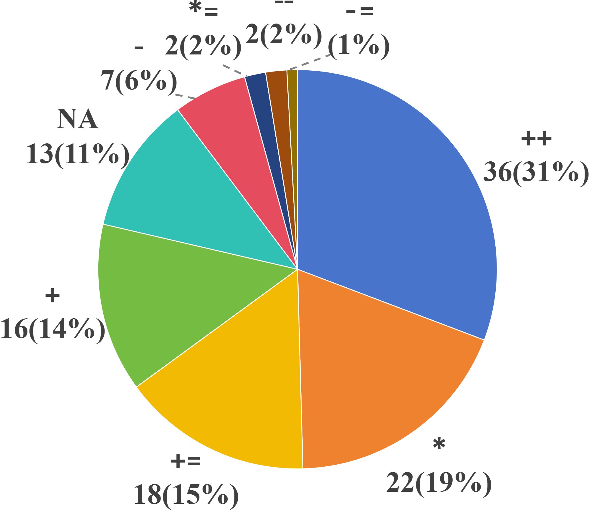
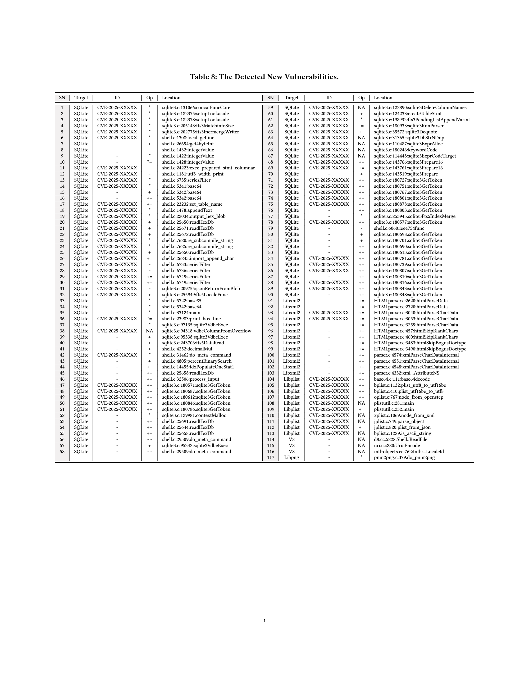
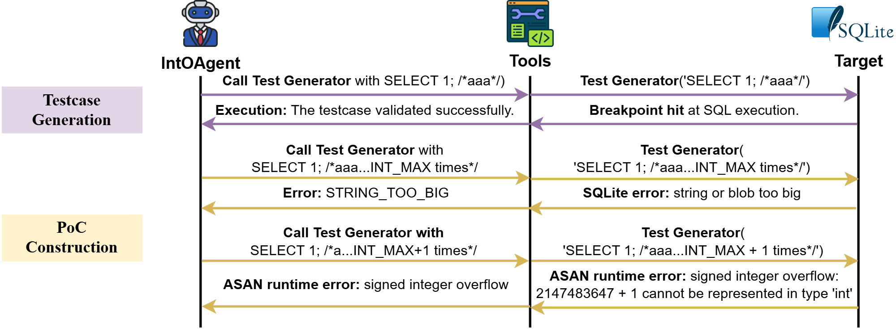

## B. Study of New Vulnerability Characteristics

IntOAgent discovered 117 unique integer overflow vulnerabilities in real-world software.
To characterize these bugs and guide future vulnerability detection, we conducted a systematic analysis of them.
Our investigation focused on two key aspects.
First, we examined the operators involved in overflow expressions to identify common vulnerability patterns.
Second, we analyzed the root causes to understand what makes these bugs difficult to detect and how detection strategies can be improved.



*Figure 1. Distribution of Operators Involved in Detected Vulnerabilities.*

Based on the operator types involved in the discovered vulnerabilities, we constructed a pie chart to show their distribution, as presented in Figure 1.
Increment operations dominate with *++* accounting for \% of cases, followed by `*` (\%), *+=* (\%), and *+* (\%).
Subtraction-related operators are less common, such as *-* (\%), *--* (\%), and *-=* (\%).
The NA category (\%) denotes overflows that occur without involving explicit operators, typically during direct value assignments where the source value exceeds the destination type's capacity (e.g., storing file sizes larger than INT_MAX).
Such vulnerabilities are often discovered when attempting to drive a variable in the target statement beyond INT_MAX, but the overflow is triggered earlier along the execution path by intermediate value assignments before reaching the target line.
These findings highlight that accumulation-based operations (*++*, *+*, *+=*: \% combined) and multiplication (`*`, `*=`: \% combined) are the primary sources of integer overflows.
Such operations inherently increase values and are thus more prone to exceeding upper bounds, suggesting they should be prioritized in vulnerability detection.
Further manual analysis of the vulnerabilities in Table Newbugs reveals three root causes.



1. **Unchecked increment.** It arises when a counter is incremented without an effective bound check (e.g., `$while(i \neq end); i++;$`), allowing repeated use of *+= 1* or *++* to eventually overflow the integer range.
For a real-world example, in Libxml2, the variable *ncol* tracks the current column number during input parsing.
When processing extremely long lines, *ncol* can exceed the 32-bit signed integer limit and wrap to a negative value, ultimately causing a segmentation fault~\cite{libxml2_commit_1005}.
This root cause accounts for 58 vulnerabilities, comprising roughly half of the issues discovered by IntOAgent.

2. **Normal Calculation.**
This root cause arises when developers perform arithmetic operations without considering potential integer overflow.
For example, as illustrated in the effectiveness section, the developer directly computes *nSep * (argc-1)* without checking whether the product may exceed the range of *int*, leading to integer overflow and subsequent program crashes.
This category accounts for 51 cases (43.97\%) of all vulnerabilities discovered by IntOAgent.

3. **Direct negation.**
Developers sometimes negate a negative integer to obtain its absolute value without realizing that the minimum 32-bit integer cannot be represented as a positive number, causing an overflow.
This issue typically appears in code patterns such as `$x < 0 ? -x : x;$`.
For instance, in the function `jsonReturnFromBlob` of SQLite~\cite{sqlite_commit_7e38287da43ea3b661da3d8c1f431aa907d648c9}, the value *iRes* is directly negated when computing the absolute value.
This design overlooks the boundary case where *iRes* equals the minimum integer, which causes signed overflow and leads to incorrect type conversion.
This type accounts for 7 cases, representing 6.03\% of all discovered by IntOAgent.

## C. Real-World Case Analysis

To demonstrate the practical value of our approach, we select an impactful vulnerability in SQLite, whose exploitation can directly affect a broad range of applications that rely on SQLite as their underlying database engine.
The vulnerability, assigned as CVE-2025-669XX, resides in *sqlite3GetToken*, a core tokenizer function that parses SQL input into tokens and computes their lengths.

```c
SQLITE_PRIVATE int sqlite3GetToken(const unsigned char *z, int *tokenType){
  int i, c;
  switch( aiClass[*z] ){ //Switch on the class of the token.
    ...
    case CC_SLASH: {
      if( z[1]!='*' || z[2]==0 ){
        *tokenType = TK_SLASH;
        return 1;
      }
      for(i=3, c=z[2]; (c!='*' || z[i]!='/') && (c=z[i])!=0; i++){} // CVE-2025-669XX: signed integer overflow of i (i++).
      if( c ) i++;
      *tokenType = TK_COMMENT;
      return i;
    }
```

In the handling of multi-line comments, the function iteratively increments a loop counter `i` until a closing delimiter is encountered or the input string terminates, provided that the input starts with `/*` and the third character is non-zero, as shown in Figure 2.
When the comment body is sufficiently long, repeated increments of `i` may cause a signed 32-bit integer overflow, leading to undefined behavior.
Notably, triggering the overflow requires the counter to cross the integer boundary rather than merely reach it, making the bug non-trivial to exploit.

**Reaching the Target Statement.**
Starting from the suspicious increment statement `i++`, IntOAgent performs vulnerability-centric analysis to determine how the buffer `z` is populated.
Through Reachable Path Prioritization, IntOAgent infers that `z` originates from attacker-controlled SQL input.
Based on this reasoning, IntOAgent synthesizes a semantically valid SQL query that satisfies the required multi-line comment prefix condition (token start from `/*`), e.g., `SELECT 1;/*aaa*/`.
The execution feedback confirms that the testcase reaches the vulnerable statement, and IntOAgent then proceeds to the next phase to trigger the overflow.

**Triggering the Overflow.**
To trigger the vulnerability, IntOAgent identifies the length of the multi-line comment as the key control variable governing the value of `i`.
The first construction attempt constructs a comment with INT_MAX length, which results in a runtime error indicating that the string or blob is too large.
Rather than interpreting this feedback as evidence of non-triggerability, IntOAgent attributes the failure to SQLite's input size enforcement instead of arithmetic safety.
After reanalyzing the loop semantics, IntOAgent refines the testcase to exceed the integer boundary and generates a comment of length INT_MAX+1.
This refined testcase successfully triggers a signed integer overflow, which is confirmed by the sanitizer and accepted as a valid PoC.

**Takeaways.**
This case illustrates that discovering integer overflows requires more than syntactic reachability under input-format constraints.
Effective exploitation depends on semantic reachability combined with constraint-aware numeric construction guided by execution feedback and accurate attribution of failures to interface constraints rather than arithmetic safety.
By integrating vulnerability-centric analysis, semantic understanding of input roles, and execution-guided PoC construction tailored to integer overflow behavior, IntOAgent reliably transforms arithmetic vulnerabilities into concrete, reproducible PoCs under realistic constraints.



*Figure 2. IntOAgent for discovering the CVE-2025-669XX.*

## D. Ethical Considerations

All experiments and analyses in this study were conducted exclusively for scientific research, with the goal of improving automated vulnerability detection rather than enabling exploitation.
**Experimental safeguards.** We implemented procedural safeguards throughout the experimental workflow. All executions of IntOAgent were confined to isolated sandbox environments based on Docker containers~\cite{docker}. These sandboxes were configured to prohibit network access and external communication, except for controlled interactions with LLMs. This design minimizes the risk of unintended dissemination of sensitive artifacts, including PoC inputs and intermediate analysis data.
**Responsible disclosure.** All newly identified vulnerabilities were responsibly reported to the respective maintainers and subsequently patched, and all communications followed coordinated disclosure practices. Although valid PoC inputs were obtained for all cases, we do not release them publicly prior to the availability of corresponding patches.

## E. Threat Model

We consider a security tester (or an adversary) whose goal is to discover integer overflow vulnerabilities in a target C/C++ software system. The adversary is assumed to 1) provide inputs to the system through its exposed interfaces (e.g., command-line arguments, files, network requests, API calls), 2) run the inputs repeatedly in a controlled environment (e.g., a testing harness or fuzzing infrastructure), and 3) observe runtime outcomes such as crashes, sanitizer reports, or logged error messages. The tester has full access to the program's source code, consistent with a white-box testing setting commonly adopted in software testing. We assume the target program under test is compiled and executed in a standard environment consistent with real deployments. For validation, we enable commonly used debugging or security instrumentation (e.g., sanitizers) to detect overflow manifestations and confirm triggering. Note that our goal is vulnerability detection and validation (i.e., demonstrating an overflow), not end-to-end exploits (e.g., RCE, privilege escalation).
